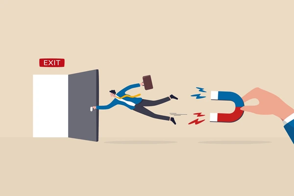
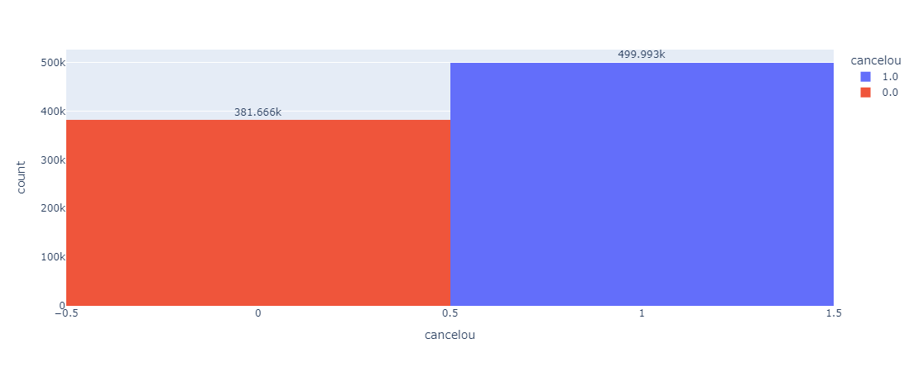
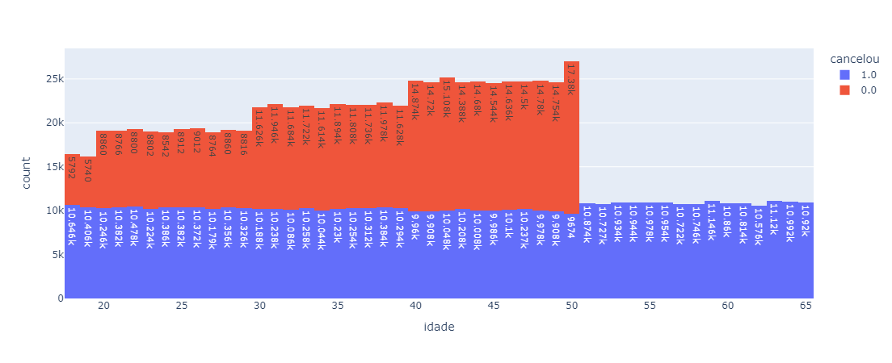
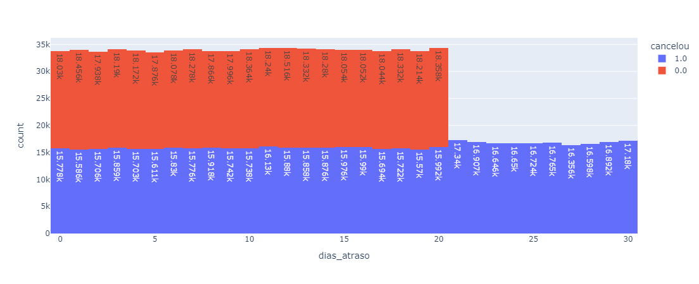
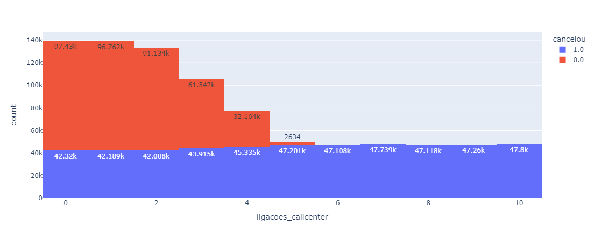
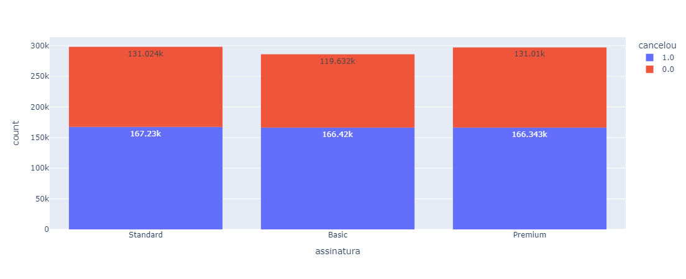

# 📊 Análise de Churn de Clientes 

Este projeto tem como objetivo analisar a taxa de churn (cancelamento de clientes)
em um banco, identificar os principais motivos que levam os clientes
a cancelarem seus serviços e propor soluções para reduzir essa taxa.
 
 
## 🏆 Objetivos
Identificar quantos clientes cancelaram suas assinaturas.
Descobrir os principais fatores que influenciam o churn.
Propor estratégias para reduzir a evasão de clientes.
Simular um cenário otimizado para demonstrar o impacto das soluções sugeridas.
 
 
## 🛠 Tecnologias Utilizadas
Linguagem: Python  
Bibliotecas: Pandas, plotly
 
 
## Principais inshgts
**A taxa de churn é cerca de 57%.**

A taxa está desequilibrada, 56,7% dos clientes cancelaram o serviço. Assim farei uma análise para descobrir suas motivações, posteriormente, descobrir soluções e qual será a taxa de churn da empresa após correção dos problemas. Para isso, visualizarei como todas as colunas impactam no cancelamento:
 
 
**Taxa de churn sobre a idade:**

**Taxa de churn sobre o atraso de pagamento:**

**Taxa de churn sobre as ligações ao CallCenter:**

**Taxa de churn sobre a assinatura:**

 
## Percepções
- Todos os clientes acima de 50 anos cancelaram o serviço. Isso significa que o serviço oferecido não é interessante para esse público. Deve-se evitar investir nesse público.
- É possível notar que todos os clientes com mais de 5 ligações ao callcenter cancelam o serviço. Criar um alerta para quando um cliente bater 3 ligações. Dar prioridade ao seu problema.
- Pós 20 dias de atraso no pagamento todos os clientes cancelaram. Criar um alerta e entrar em contato com o cliente pós 15 dias de atrasso no pagamento.
- Contratos mensais sempre cancelam. Evitar contratos mensais e incetiver anuais e quartenários.
- Clientes com menos de 500 reais gastos sempre cancelam. Incentivar o gasto maior com benefícios.
 
 
# Dados após melhorias
**Pós incentivo de planos quartenários e anuais a taxa de churn caiu cerca de 10%, um percentual que representa mais de 170 mil clientes. Uma melhoria significativa.**
